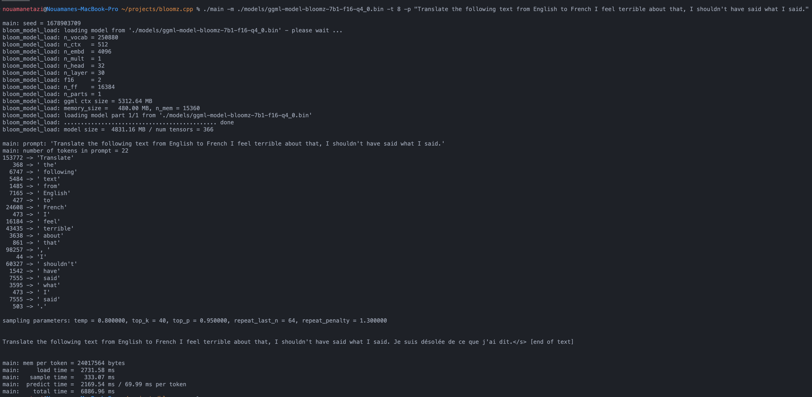
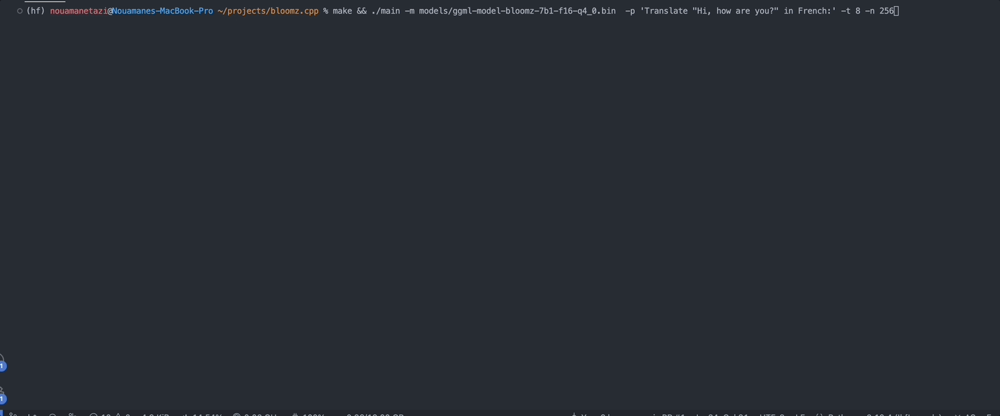
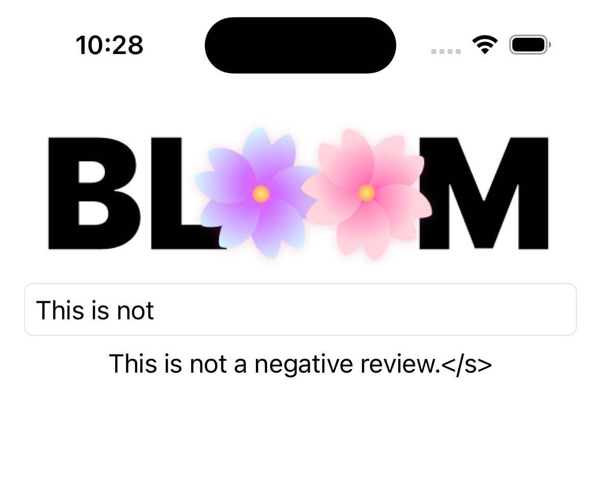

# bloomz.cpp

Inference of HuggingFace's [BLOOM-like](https://huggingface.co/docs/transformers/model_doc/bloom) models in pure C/C++.

The repo was built on top of the amazing [llama.cpp](https://github.com/ggerganov/llama.cpp) repo by [@ggerganov](https://github.com/ggerganov), to support [BLOOM](https://huggingface.co/docs/transformers/model_doc/bloom) models. It supports all models that can be loaded using `BloomForCausalLM.from_pretrained()`.



## Demo



## Usage

First, you need to clone the repo and build it:

```bash
git clone https://github.com/NouamaneTazi/bloomz.cpp
cd bloomz.cpp
make
```

### Convert weights

Then, you must convert the model weights to the ggml format. Any BLOOM model can be converted.

Some weights hosted on the Hub are already converted. You can find the list [here](https://huggingface.co/models?other=bloom&other=ggml).

Otherwise, the quickest way to convert weights is to use this [converter tool](https://huggingface.co/spaces/Wauplin/bloomz.cpp-converter).
It is a Space hosted on the Huggingface Hub that converts and quantizes weights for you and upload them to the repository of your choice.

If you prefer, you can manually convert the weights on your machine:

```bash
# install required libraries
python3 -m pip install torch numpy transformers accelerate

# download and convert the 7B1 model to ggml FP16 format
python3 convert-hf-to-ggml.py bigscience/bloomz-7b1 ./models 
# Note: you can add --use-f32 to convert to FP32 instead of FP16
```

Optionally, you can quantize the model to 4-bits.

```bash
./quantize ./models/ggml-model-bloomz-7b1-f16.bin ./models/ggml-model-bloomz-7b1-f16-q4_0.bin 2
```

### Run inference

Finally, you can run the inference.

```bash
./main -m ./models/ggml-model-bloomz-7b1-f16-q4_0.bin -t 8 -n 128
```

Your output should look like this:

```bash
make && ./main -m models/ggml-model-bloomz-7b1-f16-q4_0.bin  -p 'Translate "Hi, how are you?" in French:' -t 8 -n 256

I llama.cpp build info: 
I UNAME_S:  Darwin
I UNAME_P:  arm
I UNAME_M:  arm64
I CFLAGS:   -I.              -O3 -DNDEBUG -std=c11   -fPIC -pthread -DGGML_USE_ACCELERATE
I CXXFLAGS: -I. -I./examples -O3 -DNDEBUG -std=c++11 -fPIC -pthread
I LDFLAGS:   -framework Accelerate
I CC:       Apple clang version 13.1.6 (clang-1316.0.21.2.5)
I CXX:      Apple clang version 13.1.6 (clang-1316.0.21.2.5)

make: Nothing to be done for `default'.
main: seed = 1678899845
llama_model_load: loading model from 'models/ggml-model-bloomz-7b1-f16-q4_0.bin' - please wait ...
llama_model_load: n_vocab = 250880
llama_model_load: n_ctx   = 512
llama_model_load: n_embd  = 4096
llama_model_load: n_mult  = 1
llama_model_load: n_head  = 32
llama_model_load: n_layer = 30
llama_model_load: f16     = 2
llama_model_load: n_ff    = 16384
llama_model_load: n_parts = 1
llama_model_load: ggml ctx size = 5312.64 MB
llama_model_load: memory_size =   480.00 MB, n_mem = 15360
llama_model_load: loading model part 1/1 from 'models/ggml-model-bloomz-7b1-f16-q4_0.bin'
llama_model_load: ............................................. done
llama_model_load: model size =  4831.16 MB / num tensors = 366

main: prompt: 'Translate "Hi, how are you?" in French:'
main: number of tokens in prompt = 11
153772 -> 'Translate'
 17959 -> ' "H'
    76 -> 'i'
 98257 -> ', '
 20263 -> 'how'
  1306 -> ' are'
  1152 -> ' you'
  2040 -> '?'
     5 -> '"'
   361 -> ' in'
196427 -> ' French:'

sampling parameters: temp = 0.800000, top_k = 40, top_p = 0.950000, repeat_last_n = 64, repeat_penalty = 1.300000


Translate "Hi, how are you?" in French: Bonjour, comment ça va?</s> [end of text]


main: mem per token = 24017564 bytes
main:     load time =  3092.29 ms
main:   sample time =     2.40 ms
main:  predict time =  1003.04 ms / 59.00 ms per token
main:    total time =  5307.23 ms
```

## Advanced usage

Here's a list of the available options:

```bash
usage: ./main [options]

options:
  -h, --help            show this help message and exit
  -s SEED, --seed SEED  RNG seed (default: -1)
  -t N, --threads N     number of threads to use during computation (default: 4)
  -p PROMPT, --prompt PROMPT
                        prompt to start generation with (default: random)
  -n N, --n_predict N   number of tokens to predict (default: 128)
  --top_k N             top-k sampling (default: 40)
  --top_p N             top-p sampling (default: 0.9)
  --repeat_last_n N     last n tokens to consider for penalize (default: 64)
  --repeat_penalty N    penalize repeat sequence of tokens (default: 1.3)
  --temp N              temperature (default: 0.8)
  -b N, --batch_size N  batch size for prompt processing (default: 8)
  -m FNAME, --model FNAME
                        model path (default: models/ggml-model-bloomz-7b1-f16-q4_0.bin)
```

## Memory usage

| Model | Disk | Mem |
| --- | --- | --- |
| `bloomz-7b1-f16-q4_0` | 4.7 GB | 5.3 GB |

## iOS App

The repo includes a proof-of-concept iOS app in the `Bloomer` directory. You need to provide the converted model weights, placing a file called `ggml-model-bloomz-560m-f16.bin` inside that folder. This is what it looks like on an iPhone:


